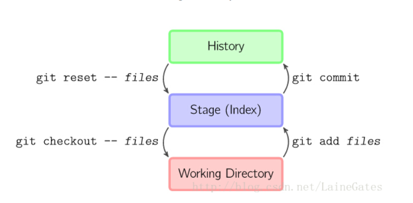
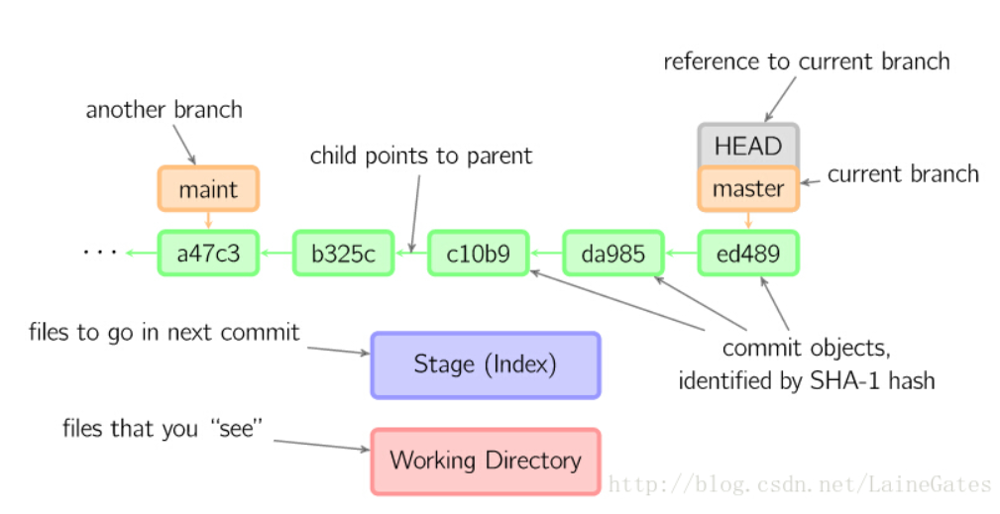
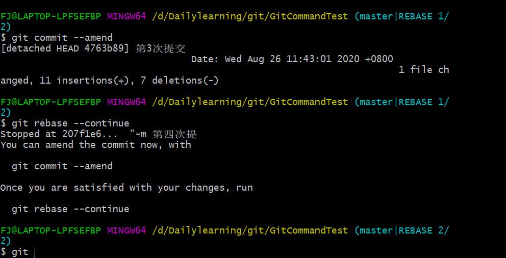
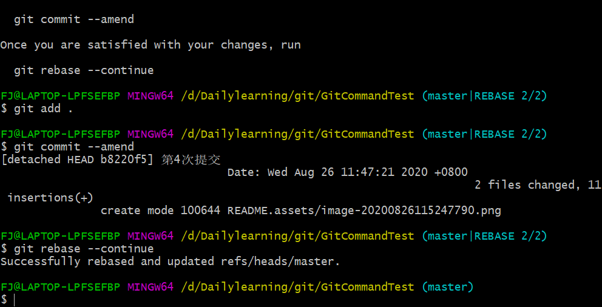
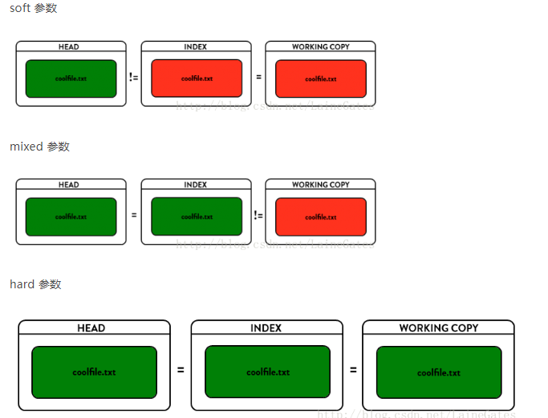

# Git命令学习

### git基础原理

- History，所有提交过的commit保存的位置，也就是说只要commit过，都是历史，可以回到过去~
- Stage(index)，也就是当前git add过的但尚未commit的文件
- Work directory，就是当前正在改的代码了




4个指针（很像C/C++语言的指针）：
（1）我们常用的branch（像master/dev/…）
（2）动态的HEAD，也就是当前用户在Git树中的位置，这个名称是固定的，三个命令的工作就是让这个HEAD来回走；
（3）index指针；
（4）work directory指针。



### 基础命令


```powershell
# 拉取
git pull
# 上传
git add .
git commit -m "注释"
git push
```


### 修改本地commit记录

#### 修改最近一次提交

```powershell
# 如果需要修改内容，需要将新的内容添加进来，只修改注释不用执行add命令
git add .
# 执行命令后会进入vim编辑状态，在里面修改注释
git commit --amend
```


#### 修改最近多次提交

```powershell
# 修改最近n次提交
# 会进入vim编辑状态，
# 最上面的几条数据表示commit历史，按照提交的顺序排序，最下面一行时最后的一次提交
# 在需要修改的commit上，将pick改为edit
# 保存退出
git rebase -i HEAD~n
```


然后分支会自动变为master|REBASE-i 1/2，也就是上上次的commit

后面操作参照[修改最近一次提交](####修改最近一次提交)，修改完成后，使用 `git rebase --continue` 命令继续下一个commit修改



修改完成之后，会自动回到master分支




### 删除远程分支上的某次提交

#### 删除最后一次提交

比如现在有版本：

commit 3

commit 2

commit 1

```powershell
# 方法一：使用revert,这种方式会生成一个新的版本commit 4,但是其内容是commit 2的内容
# 退回一个版本
git revert HEAD
# 提交分支
git push origin master

# 方法二：使用reset,这种方式会直接退回到commit 2
# 退回一个版本,注意这类可以选择reset的参数
git reset --hard HEAD^
# 提交分支，因为本地库落后远程库一个版本，需要强制提交
git push origin master -f
```


### git reset

--soft 可以撤销commit操作

--mixed(可以省略) 可以撤销add 操作

--hard 慎用，会清空当前work directory中的内容，即你本地当前的内容




#### 删除指定提交

```
git reset commitId
```


### 分支

```powershell
# 查看当前分支
git branch
# 查看远程分支
git branch -r
# 新建分支
git branch myBranch
# 切换到分支
git checkout myBranch
# 在当前分支上合并其他分支
git checkout master
git merge myBranch
# 删除分支
git branch -d myBranch
```


### 冲突解决

当进行分支合并时，如果出现代码冲突，就需要进行冲突解决
即当使用命令 `git merge myBranch`后，出现 `CONFLICT (content): Merge conflict in xx.txt`
就表示在xx.txt文件上出现冲突
打开冲突文件，会发现下面的代码
```
# 这里面就是两个版本冲突的地方，然后在这里修改解决冲突
<<<<<<< HEAD
Creating a new branch is quick & simple.
=======
Creating a new branch is quick AND simple.
>>>>>>> feature1
```

修改之后使用 `git add xx.txt` 将修改后的文件重新添加到index，然后和其他没有冲突的文件一起commit，然后push
